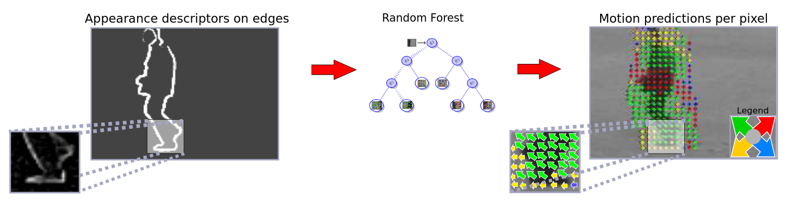

# DejaVu: Motion Prediction in Static Images



Official implementation of the DejaVu: *"DejaVu: Motion Prediction in Static Images"*, Silvia L.Pintea, Jan C. van Gemert, Arnold WM Smeulders, European Conference on Computer Vision (ECCV), 2014. (<a href="https://arxiv.org/abs/1803.06951">archive link </a>)


This work proposes motion prediction in single still images by learning it from a set of videos. The building assumption is that similar motion is characterized by similar appearance. The proposed method learns local motion patterns given a specific appearance and adds the predicted motion in a number of applications. This work (i) introduces a novel method to predict motion from appearance in a single static image, (ii) to that end, extends of the Structured Random Forest with regression derived from first principles, and (iii) shows the value of adding motion predictions in different tasks such as: weak frame-proposals containing unexpected events, action recognition, motion saliency. Illustrative results indicate that motion prediction is not only feasible, but also provides valuable information for a number of applications.

## Project webpage: i<a href="https://silvialaurapintea.github.io/dejavu.html"> https://silvialaurapintea.github.io/dejavu.html </a>

### Requirements
The code was tested on Linux (Ubuntu 14.04 LTS):
- OpenCV2.4.+, 
- vlfeat-0.9.16, 
- dlib-18.7
-  Boost.

### Buiding the code
Edit the bin/CMakeLists.txt with the correct path towards the sources directory. 

```
cmake CMakeLists.txt
make
```

### Organization:

This code is organized as follows:
```
src/                                	    -- All C++ sources of the project
        helpers/                    	    -- Auxiliary functionality
        	Auxiliary.cpp/.h    	    -- Printing, matrix operations
        	SIFTlik.cpp/.h      	    -- Descriptor extraction
   		Tree.cpp/.h	    	    -- Builds the tree structure
	motionRF/			    -- All files that implement the motion trees
		MotionPatch.cpp/h   	    -- Defines the motion patch
		MotionPatchFeature.cpp/h    -- Extracts features from patches
		MotionPuzzle.cpp/h          -- Merges the predicted motions
		MotionRF.cpp/h		    -- Trains decision trees
		MotionRFdetector.cpp/h      -- Used at inference time
		MotionTree.cpp/h	    -- Tree utilities
		MotionTreeNode.cpp/h 	    -- Utilities for the tree nodes
		RunMotionRF.cpp/h           -- Combines everything together 
		evaluation
			MotionEval.cpp/.h   -- Evaluates motion predictions
	structuredRF/
		Puzzle.cpp/h 		    -- Combines labelings
		StructuredPatch.cpp/h       -- Defines the motion patch
		StructuredRF.cpp/h	    -- Trains structured decision tree
		StructuredRFdetector.cpp/h  -- Used at inference time
		StructuredTree.cpp/h	    -- Structured tree utilities
		StructuredTreeNode.cpp/h    -- Utilities for the structured tree nodes
		RunRF.cpp/h 		    -- Combines everything together
		evaluation
			LabelEval.cpp/.h    -- Evaluates structured predictions
motionMain.cpp 				    -- The main call for the motion predictions
structuredMain.cpp 			    -- The main call for structured predictions
```

Third party software:
```
third                   
	forest -- Implements Gall J. and Lempitsky V., "Class-Specific Hough Forests for Object Detection", (CVPR'09).
	sintel -- For optical flow reading from https://github.com/dscharstein/imageLib (C++ image library by Rick Szeliski and Daniel Scharstein, evolved from StereoMatcher code)
```
All credit for third party sofware is with the authors.


### Usage
Edit the config file with the corresponding paths towards data (see bin/config_example.txt):

- Usage: ./dejavu [what] [mode] [config.txt]

- [what]: 0 - motion; 1 - motion evaluation

[mode (0)]: 0 - train; 1 - test; 2 - train & test; 3 - extract; 4 - extract flow (only Motion); 5 - train with jobrunners; 6 - test with    jobrunners; 7 - extract OF with jobrunners

[mode (1)]: 0 - segmentation error, 1 - motion error, 2 - raw values for python, 3 - all.

[mode (2)]: generate config files

### Citation
If you use this code, please cite the publication:

```
@inproceedings{pintea2014deja,
  title={D{\'e}ja vu: Motion prediction in static images},
  author={Pintea, Silvia L and Gemert, Jan C van and Smeulders, Arnold WM},
  booktitle={European Conference on Computer Vision},
  pages={172--187},
  year={2014},
  organization={Springer}
}
```

